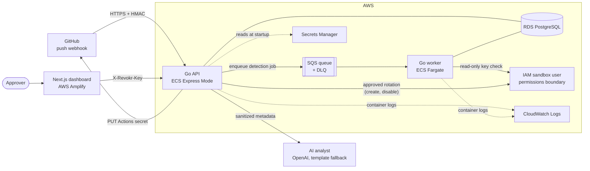
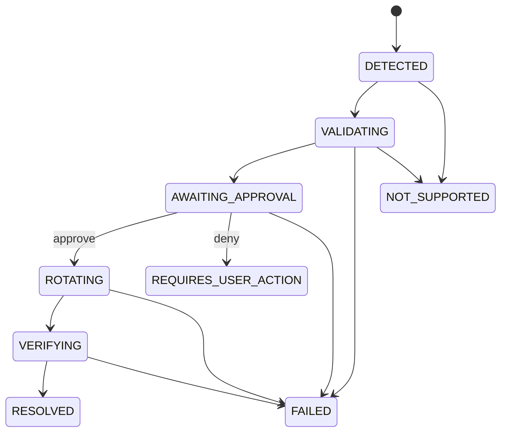

# Architecture

This document describes what Revokr is built from, how a leaked secret moves through it, and
which guarantees the code actually enforces. Section 9 lists where the running system differs
from the original plan.

## 1. System overview



Two long-running Go processes share one codebase:

- **API** ([cmd/api](cmd/api/main.go)) — receives and verifies the GitHub webhook, enqueues
  jobs, and serves the incident endpoints the dashboard reads. Approving an incident runs the
  rotation inside the API process.
- **Worker** ([cmd/worker](cmd/worker/main.go)) — polls SQS, scans, scores, creates the incident
  and runs validation (a read-only IAM check for real incidents), leaving it at
  `AWAITING_APPROVAL`. It never rotates anything; that happens in the API after approval.

The **dashboard** ([web/revokr](web/revokr)) is a server-rendered Next.js app. The browser never
talks to the Go API directly: pages fetch on the server, and approve/deny go through Next route
handlers that check the session first.

## 2. AWS services and why

| Service | Used for | Why this and not something else |
|---|---|---|
| **Amplify Hosting** | Dashboard | Git-connected deploys give a public HTTPS URL with no server to run. `amplify.yml` writes console variables into `.env.production`, because Amplify does not otherwise expose them to server code. |
| **ECS Fargate** | API (Express Mode) and worker | Containers without managing hosts. The plan was App Runner, but it became unavailable during the event, so both moved to ECS. The worker is a plain Fargate service because Express Mode requires an HTTP health check and the worker only polls a queue. |
| **RDS PostgreSQL 16** | System of record | A micro instance (`db.t4g.micro` in the notes), 20 GiB gp3, single-AZ, no deletion protection: sized for a four-day event and easy to tear down. Relational because the incident → actions → audit-log links and the `CHECK` constraints on status values are worth having in the database. |
| **SQS + DLQ** | Push events → worker | Decouples the webhook response from scanning. Visibility timeout 120 s; a message received 5 times moves to the DLQ. See §9 for a gap in how the worker uses this. |
| **Secrets Manager** | GitHub App private key, webhook secret, DB password, Slack webhook | Only ARNs live in configuration. The DB password is injected into the task from the RDS-managed secret rather than written into the task definition. |
| **IAM** | Remediation target | A dedicated sandbox user whose access keys Revokr may manage. The notes and the code default use `test-user`; the Terraform defines `demo-leaked-user` under `/revokr-targets/`. See §4 and §9 for how these fit together. |
| **CloudWatch Logs** | Container logs | ECS container logs give an evidence trail outside our own UI. The notes record the worker's log group (`/ecs/revokr-worker`); we did not separately document the API's. |

## 3. The life of an incident



The allowed transitions live in one map ([state.go](internal/incidents/state.go)). The database
`CHECK` constraint on `incidents.status` only restricts the *set of values*, not which value may
follow which, so the transition rules are enforced in Go. `Transition` is the only code that
updates `incidents.status`: it rejects a disallowed move, updates the row, then writes an
`audit_logs` row. Those are two separate statements rather than one database transaction, so a
crash between them could leave a status change without its audit row.

**Detect and validate (worker).**
1. The webhook handler verifies `X-Hub-Signature-256` with a constant-time HMAC compare, parses
   the push payload and enqueues a `DetectionJob`.
2. The worker scans `diff_content` ([detector.go](internal/detector/detector.go)). For each match
   it stores a **masked value** (first 4 and last 4 characters) and a **SHA-256 fingerprint**.
   Incidents are unique per `(repository_id, fingerprint)`.
3. The worker looks up the repository row by owner and name. The lookup never creates one, and
   if there is no match it falls back to *any* repository (§9). The risk engine scores the
   finding (§5) and the incident is written with `DETECTED`. With no repository row at all the
   worker only logs the masked finding and stores nothing.
4. `PerformValidation` moves it to `VALIDATING` and asks the adapter whether the key is live. For
   AWS this is `iam:ListAccessKeys` on the target user, because the leaked key's secret half is
   never captured and so the key cannot be tested by authenticating as it. Whether or not the key
   is live, the incident lands at `AWAITING_APPROVAL`; liveness is shown to the approver.
5. A real (non-simulated) incident for any provider other than AWS goes to `NOT_SUPPORTED`.

**Approve and rotate.** One approval runs the whole remaining sequence
([rotate.go](internal/incidents/rotate.go), [verify.go](internal/incidents/verify.go)):

1. `AWAITING_APPROVAL → ROTATING`
2. **Create** a replacement access key and **validate** it by authenticating as the new key
   (`sts:GetCallerIdentity`, retried to ride out IAM propagation delay).
3. **Update the destination**: encrypt the new key pair with the repository's public key
   (libsodium sealed box) and PUT it as the `AWS_ACCESS_KEY_ID` / `AWS_SECRET_ACCESS_KEY`
   Actions secrets.
4. `ROTATING → VERIFYING`
5. **Disable the old key** and confirm IAM reports it `Inactive` (retried).
6. `VERIFYING → RESOLVED`

Each step is recorded as a row in `actions` (`VALIDATE_CREDENTIAL`, `ROTATE_CREDENTIAL`,
`UPDATE_GITHUB_SECRET`, `DISABLE_OLD_CREDENTIAL`) with its own success or failure.

**Failure handling.**
- If creating the replacement key fails, nothing was changed and the incident is `FAILED`.
- If the replacement key is created but **fails validation**, it is left active: only the GitHub
  update step cleans up after itself (see §9). The incident is `FAILED`.
- If step 3 fails, the replacement key exists but nobody holds its secret, so
  `disableReplacement` deactivates it before the incident is marked `FAILED`. The old key is
  untouched, so the user's pipeline keeps working. Whether that clean-up worked is recorded in
  the audit metadata.
- If step 5 fails, the incident is `FAILED` and the error is recorded. The new key is already in
  the GitHub secret, so the pipeline works, but the old key may still be active.
- A denied approval moves the incident to `REQUIRES_USER_ACTION` without reaching any provider.

## 4. Provider adapters and Simulation Mode

Everything that touches a credential goes through one interface
([provider/adapter.go](internal/provider/adapter.go)): `Validate`, `Rotate`, `Revoke`.
[providers.Select](internal/providers/selector.go) is the only place an adapter is chosen, and a
simulated incident is always routed to the simulated adapter regardless of anything else.

The simulated adapter ([providers/simulated](internal/providers/simulated/adapter.go)) is a
separate package that imports no AWS or HTTP client, so simulation cannot perform a real action
even by mistake. Simulated incidents still create the same `actions` rows and audit entries, and
the audit metadata carries `simulated: true`, so their timeline has the same shape as a real one.

**What decides real versus simulated.** Only the incident's own `simulated` flag, which is copied
from the `simulated` field of the signed webhook body. A push from real GitHub has no such field,
so it is treated as real. The dashboard's Settings "Simulation mode" switch is a browser cookie
that drives the banner and labels; it does not change which adapter the backend uses.

The real AWS adapter ([internal/aws](internal/aws/adapter.go),
[providers/aws](internal/providers/aws/iam.go)) only ever acts on the single user named in
`REMEDIATION_TARGET_IAM_USERNAME`. It authenticates with the default AWS credential chain, so it
runs as whatever role its ECS task has. It does **not** assume the permissions-boundary role
itself (`REMEDIATION_ROLE_ARN` appears in the config template but no code reads it). The
Terraform and the notes define a role capped by a permissions boundary to access-key operations,
so the cap only applies if the task runs as that role. Neither the Terraform nor the notes grant
`AdministratorAccess`.

## 5. Risk engine

[risk.go](internal/risk/risk.go) is deterministic and has no model in it. The score is the sum of
these factors, capped at 100. The list of factors that contributed is stored on the incident and
shown in the UI, so the number is always explainable.

| Factor | Points |
|---|---|
| Exposed in a public repository / private repository | 40 / 15 |
| AWS credential | 30 |
| OpenAI or Stripe key | 25 |
| GitHub token | 25 |
| Any other provider | 10 |
| Committed to the default branch | 15 |
| Repository flagged production | 15 |
| Leak under 1 hour old / under 24 hours old | 10 / 5 |
| Secret seen across multiple commits | 10 |

Severity: `CRITICAL` ≥ 80, `HIGH` ≥ 60, `MEDIUM` ≥ 40, otherwise `LOW`.

## 6. AI incident analyst

[internal/bedrock](internal/bedrock) (the package name is a leftover from the original plan; see
§9) builds an explanation of each incident on demand from `GET /api/incidents/:id/analysis`.

- **Input is a whitelist type.** `SanitizedIncident` has no field meant to hold a raw secret or
  file contents, only the masked value, provider, severity, risk factors, status, repository
  owner and name, file path, line and commit SHA. Note that this is sent to OpenAI when a key is
  configured. Be aware of one gap: the HTTP handler builds `SanitizedIncident` field by field
  ([analysis.go](internal/incidents/analysis.go)) and does not call `SanitizeIncident`. That
  function, and the unit test that feeds it a raw secret and checks it is dropped, are exercised
  only by the tests. The protection in production is the struct's shape plus the handler copying
  only masked and metadata fields from the database.
- **Output** is `summary`, `whyItMatters`, `recommendedResponse`, `confidence` and a `source`.
- **Backend** is OpenAI `gpt-4o-mini` with a strict JSON schema. If the call fails or no key is
  configured, `FallbackAnalyzer` uses a deterministic template and `source` says `template`, so
  the UI never shows canned text as an AI answer.
- **The analyst cannot act.** It returns text to the HTTP handler and nothing else. It has no
  reference to any adapter and no write path to `actions`; deciding what to rotate and whether to
  proceed is entirely in the state machine and the human approval.

## 7. Security model

What the code enforces, and where:

| Property | Enforced by |
|---|---|
| No raw leaked secret stored or logged | The detector keeps only a masked value and a fingerprint. The one identifier kept in full is the AWS access key **ID** (`resource_ref`), needed to act on the key. It is not sensitive on its own, and the leaked key's secret half is never captured. |
| `resource_ref` is not returned as a field | Tagged `json:"-"` on `Incident`. Key IDs can still appear inside free-text audit details and error messages (for example the replacement key's ID in the rotation detail). They are identifiers, not secrets. |
| Replacement key's secret never persisted | It is returned from `Rotate` in memory and handed straight to the GitHub secret update. It is not written to the database, audit metadata or logs. |
| Nothing secret in notifications | The Slack `Message` type has no field for a secret, not even the masked value. |
| Webhooks are authentic | HMAC-SHA256 of the raw body, constant-time compare, 401 otherwise. |
| API is not open to the internet | When `REVOKR_API_KEY` is set, every `/api/*` route requires the `X-Revokr-Key` header ([apiauth](internal/apiauth/apiauth.go)): both sides hashed, then constant-time compared. If it is unset the API is open (intended for local development; the API logs which mode it is in). `/health`, the webhook and the install callback are outside `/api/` and authenticate differently or not at all. |
| Only a signed-in person can approve | The dashboard's approve/deny routes check origin and session before forwarding. The Go API only checks the shared key, so this is the only per-user check on that path, and anyone holding the key can call `/approve` or `/transition` directly with any `actor` text. The signed-in user's login is recorded as the audit actor. |
| Demo sign-in cannot cause real changes | A demo session may only approve or deny incidents where `simulated` is true. It can still read every incident the connected API returns (§9). |
| Session integrity | HMAC-signed cookie, `HttpOnly`, `SameSite=Lax`, `Secure` in production. The GitHub access token inside it is AES-256-GCM encrypted. |
| Least privilege on AWS | A permissions boundary on the remediation role limits it to access-key operations on the target user, and denies creating users or changing policies and the boundary itself. This holds only when the task runs as that role (§4), and the notes list an unfinished follow-up: the resource ARN there still has a wildcarded account ID. |
| App secrets not in the repo | `.env` is git-ignored and was never committed. GitHub App key and webhook secret come from Secrets Manager by ARN. |
| Every sensitive action audited | `audit_logs` rows with actor, action, result, timestamp and metadata; the dashboard reads them back. |

## 8. Data model

Migrations are in [migrations/](migrations).

```
users ─< github_installations ─< repositories ─< incidents ─< actions
                                                     └──────< audit_logs
```

- `incidents`: repository, commit SHA, file, line, provider, secret type, `fingerprint`,
  `masked_value`, `resource_ref`, `is_live`, `severity`, `risk_score`, `risk_factors` (JSONB),
  `status`, `simulated`, timestamps. `UNIQUE (repository_id, fingerprint)`.
- `actions`: one row per remediation step, with status, error and timing, and a unique
  idempotency key of `incident:action_type` so a repeated start updates the row instead of
  duplicating it. (It has no `simulated` column; that lives on the incident.)
- `audit_logs`: actor, action, result, metadata, timestamp.
- `repositories` requires an installation, which requires a user. Nothing in the code creates
  those rows yet, so they are inserted by hand. There is no `is_production` column, which is why
  the "production repository" risk factor cannot fire.

## 9. Known limitations and deviations from the original plan

Listed so a reader does not have to discover them.

| Item | Reality | Effect |
|---|---|---|
| **Real pushes are not scanned** | The worker only scans a `diff_content` field, which GitHub's push payload never contains, and nothing fetches the commit diff. | The pipeline runs from a signed synthetic webhook; a real `git push` currently produces no incident. |
| **Detection is not Gitleaks** | The plan called for Gitleaks; the code uses 5 hand-written regexes. | Narrower coverage (no Google Cloud, no generic-entropy rules). |
| **AI analyst is not on Bedrock** | The analyst calls OpenAI and falls back to a template. The `bedrock` package name is historical. | The AI step is the one piece of the system not running on AWS. In the deployed tasks the OpenAI key was not wired as of the last notes, so the template is what runs there. |
| **No KMS use in code** | `KMS_KEY_ID` is reserved in the config template but nothing reads it. | Encryption at rest is whatever RDS and Secrets Manager provide by default; we make no further claim. |
| **Real IAM rotation not run on the deployed stack** | The adapter and boundary exist; the ECS task role lacked the required permissions at last check. The code does not assume the bounded role (§4). The Terraform bounds users under `/revokr-targets/` (`demo-leaked-user`), while the code and the notes target `test-user` (no path), so that Terraform as written would not permit acting on `test-user`. | Only simulation is demonstrated end to end on AWS. Which role and user the real path uses has to be settled and tested before it can be called least-privilege. |
| **A failed validation leaves an orphan key** | If the replacement key is created but fails validation, nothing disables it. AWS allows at most two access keys per IAM user. | The user then holds two keys, so a retry would fail until one is removed by hand. |
| **Simulation switch is cosmetic** | The Settings toggle sets a cookie that controls the banner and labels. Real versus simulated is decided per incident by the webhook's `simulated` flag. | Once the switch has been used, the banner and the switch's own text follow the cookie, not the data (until then they follow whether any incident is simulated). So it can say "Off — actions affect real credentials" while the incident being approved is simulated, or the reverse. |
| **Repository lookup can pick the wrong repository** | `ResolveRepositoryID` never creates a repository, and when the pushed owner/name is not found it uses any repository in the table. | In real mode the GitHub secret update targets the repository the incident is attached to, so an unknown repo could cause secrets to be written to a different one. Fine for a single-repo demo, not for multi-repo use. |
| **Demo sign-in can read incident data** | The demo session is open to anyone and the incident pages do not restrict reads by session mode. | With the dashboard connected to a real API, an anonymous visitor can view incident metadata (repository, commit, file, masked value). They cannot approve real incidents. |
| **GitHub secret update is unverified and uses a PAT** | `GetSecretMeta` exists but is not called after the write; auth is a personal token, not an installation token. The install callback does not persist installations yet. | The step is trusted rather than confirmed; not per-installation. |
| **Risk inputs partly fixed** | The worker passes `IsDefaultBranch = true` and `CommitTime = now`, and never sets `IsProduction` or `MultiCommitLeak` (and the schema has no production flag). | Every finding gets the default-branch and "fresh leak" points, and two factors are unreachable, so scores run high. |
| **Worker acknowledges failed jobs** | It deletes the SQS message even when handling returned an error. | The DLQ and redelivery never trigger for handler errors. |
| **Approval runs inside the API request** | Rotation, including IAM propagation retries, executes in the approve request. | Long-lived requests; a proper design would enqueue a rotate job. |
| **Repositories and Onboarding pages are sample data** | No API endpoint exists for repositories or installations yet. | Those two pages do not reflect real state. |
| **Single remediation target** | One pre-provisioned IAM user, not one discovered from the leaked key. | Fits a sandbox demo; not a general product. |
| **No git-history cleanup** | Deliberately out of scope. | Rotation makes the leaked key useless; it does not remove it from history. |
